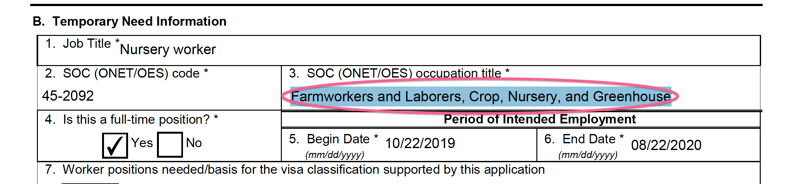

.. meta::
   :description: pdfreader - How to parse PDF Forms
   :keywords: pdfreader,python,pdf,form,parse,extract,SimplePDFViewer
   :google-site-verification: JxOmE0CjwDilnJCbNX5DOrH78HKS6snrAxA1SGvyAzs
   :og:title: pdfreader - How to parse PDF Forms
   :og:description: Extracting data from PDF forms. A real life example.
   :og:site_name: pdfreader docs
   :og:type: article

.. testsetup::

  from pdfreader import SimplePDFViewer
  import pkg_resources, os.path
  samples_dir = pkg_resources.resource_filename('doc', 'examples/pdfs')
  file_name = os.path.join(samples_dir, 'example-form.pdf')

How to parse PDF Forms
======================

In most cases texts come within page binary content streams and can be extracted as in
:ref:`tutorial-texts` and :ref:`examples-parse-texts`.

There is one more place where text data can be found: page forms. Form is a special subtype of XObject which
is a part of page resources, and can be referenced from page by `do` command.

You may think of Form as of "small subpage" that is stored aside main content.

Have a look at one :download:`PDF form <pdfs/example-form.pdf>`.

Let's open the document and get the 1st page.

.. doctest::

  >>> from pdfreader import SimplePDFViewer
  >>> fd = open(file_name, "rb")
  >>> viewer = SimplePDFViewer(fd)

And now, let's try to locate a string, located under the section *B.3 SOC (ONET/OES) occupation title*

.. doctest::

  >>> viewer.render()
  >>> plain_text = "".join(viewer.canvas.strings)
  >>> "Farmworkers and Laborers" in plain_text
  False

Apparently, the texts typed into the form are in some other place. They are in Form XObjects,
listed under page resources. The viewer puts them on canvas:

.. doctest::

  >>> sorted(list(viewer.canvas.forms.keys()))
  ['Fm1', 'Fm10', 'Fm11', 'Fm12', 'Fm13', 'Fm14',...]

As Form is a kind of "sub-document" every entry in *viewer.canvas.forms* dictionary maps to
:class:`~pdfreader.viewer.SimpleCanvas` instance:

.. doctest::

  >>> form9_canvas = viewer.canvas.forms['Fm9']
  >>> "".join(form9_canvas.strings)
  'Farmworkers and Laborers, Crop, Nursery, and Greenhouse'

Here we are!

More on PDF Form objects: `see sec. 8.10 <https://www.adobe.com/content/dam/acom/en/devnet/pdf/pdfs/PDF32000_2008.pdf#page=217>`_