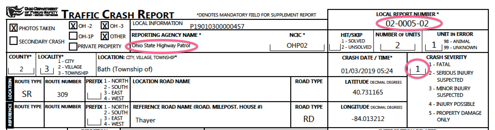

.. meta::
   :description: pdfreader - How to parse PDF to extract texts
   :keywords: pdfreader,python,pdf,text,parse,extract,SimplePDFViewer
   :google-site-verification: JxOmE0CjwDilnJCbNX5DOrH78HKS6snrAxA1SGvyAzs
   :og:title: pdfreader - How to parse PDF to extract texts
   :og:description: Real-life examples on extracting plain and formatted texts from PDF.
   :og:site_name: pdfreader docs
   :og:type: article

.. testsetup::

  from pdfreader import SimplePDFViewer
  import pkg_resources, os.path
  samples_dir = pkg_resources.resource_filename('doc', 'examples/pdfs')
  file_name = os.path.join(samples_dir, 'example-text-crash-report.pdf')

.. _examples-parse-texts:

How to parse PDF texts
======================

Simple ways of getting plain texts and formatted texts from documents are discussed in the tutorial :ref:`tutorial-texts`,
so let's focus on advanced techniques.

In this example we build a parser for :download:`traffic crash reports <pdfs/example-text-crash-report.pdf>`,
that extracts:

 - local report number
 - reporting agency name
 - crash severity

from the first page. The parser can be applied to all crash reports like that.

Let's open the document and render the first page:

.. doctest::

  >>> from pdfreader import SimplePDFViewer
  >>> fd = open(file_name, "rb")
  >>> viewer = SimplePDFViewer(fd)
  >>> viewer.render()

Every PDF page has one or more binary content streams associated with it. Streams may contain inline images,
text blocks, text formatting instructions, display device operators etc.
In this example we stay focused on text blocks.

Every text block in a stream is surrounded by BT/ET instructions and usually tricky encoded.
Fortunately the viewer understands lot of PDF operators and encoding methods, so after rendering
we may access human-readable PDF markup containing decoded strings.

.. doctest::

  >>> markdown = viewer.canvas.text_content
  >>> markdown
  "... BT\n/F3 6.0 Tf\n0 0 0 rg\n314.172 TL\n168.624 759.384 Td\n(LOCAL INFORMATION) Tj\n ..."

This text block contains instructions for a viewer (font, positioning etc.) and one string surrounded by brackets.

.. doctest::

  >>> viewer.canvas.strings
  ['LOCAL INFORMATION', 'P19010300000457', ...]

Text-related :class:`~pdfreader.viewer.SimpleCanvas` attributes are:

- :attr:`~pdfreader.viewer.SimpleCanvas.text_content` - contains all data within a single BT/ET block:
  commands and text strings. All text strings are surrounded by brackets and decoded
  according to the current graphical state (*q, Q, gs, Tf* and few other commands).
  The value can be used to parse text content by PDF markdown.

- :attr:`~pdfreader.viewer.SimpleCanvas.strings` - list of all strings as they come in text blocks.
  Just decoded plain text. No PDF markdown here.

How to parse PDF markdown
-------------------------

At this point `markdown` contains all texts with PDF markdown from the page.

.. doctest::

  >>> isinstance(markdown, str)
  True

Let's save it as a text file and analyze how can we extract the data we need.

.. doctest::

  >>> with open("example-crash-markdown.txt", "w") as f:
  ...     f.write(markdown)
  52643

Open your favorite editor and have a look at :download:`the file <downloads/example-crash-markdown.txt>`.

Now we may use any text processing tools like regular expressions, grep, custom parsers to extract the data.

.. doctest::

  >>> reporting_agency = markdown.split('(REPORTING AGENCY NAME *)', 1)[1].split('(', 1)[1].split(')',1)[0]
  >>> reporting_agency
  'Ohio State Highway Patrol'

  >>> local_report_number = markdown.split('(LOCAL REPORT NUMBER *)', 1)[1].split('(', 1)[1].split(')',1)[0]
  >>> local_report_number
  '02-0005-02'

  >>> crash_severity = markdown.split('( ERROR)', 1)[1].split('(', 1)[1].split(')',1)[0]
  >>> crash_severity
  '1'

Here we are!

Useful links
------------

  - Detailed description of PDF texts is `here (see sec. 9) <https://www.adobe.com/content/dam/acom/en/devnet/pdf/pdfs/PDF32000_2008.pdf#page=237>`_
  - Conforming reader graphical state reading is `here (see sec. 8.4) <https://www.adobe.com/content/dam/acom/en/devnet/pdf/pdfs/PDF32000_2008.pdf#page=121>`_

